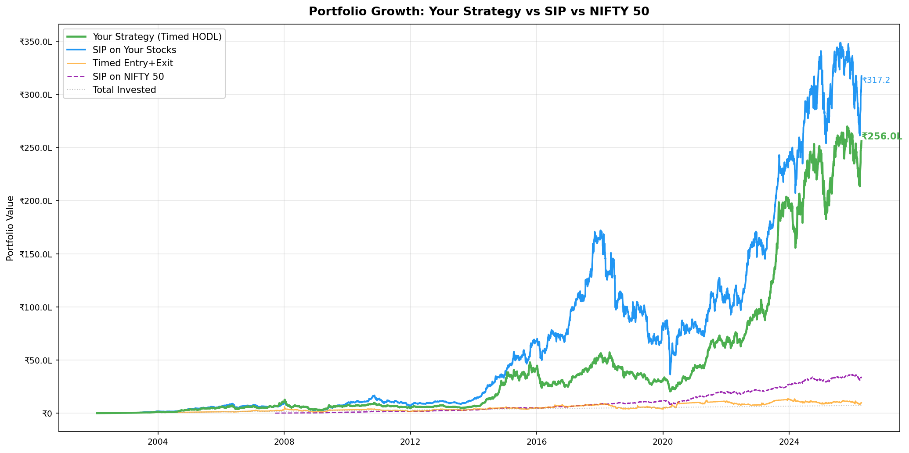
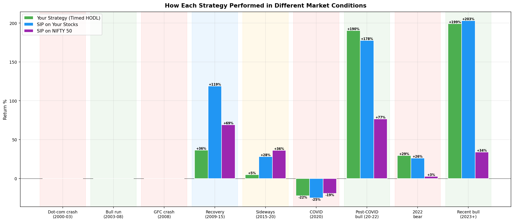
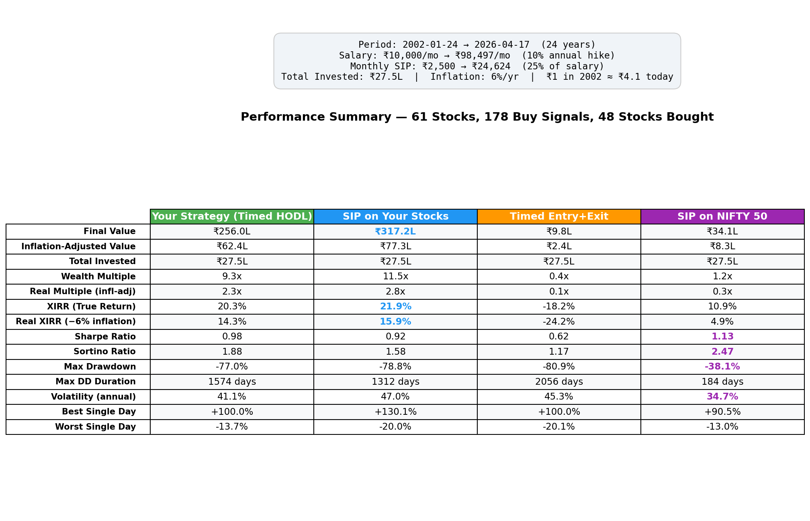

# Algorithmic Trading Bot — Crash-Buy Signals for Indian Equities (NSE)

An automated **algo-trading signal system** that identifies deeply undervalued stocks during market crashes using **200-period Bollinger Bands** and **dual MACD crossovers**, then delivers actionable buy signals with market sentiment to Telegram — fully automated via GitHub Actions.

> **Philosophy**: Buy the crash, hold forever. This bot watches 60+ fundamentally screened NSE stocks and alerts when they hit statistically extreme lows with confirmed momentum reversal. No day-trading, no exits — just long entries at high-conviction dips.
>
> The watchlist in `stocks.txt` is curated via a separate fundamental analysis tool (not included in this repo) — this bot handles the technical timing layer on top of that fundamental filter.

### [Join the Telegram channel to receive live signals](https://t.me/dipmafia)

---

## How It Works

```
┌─────────────────────────────────────┐
│         stocks.txt (watchlist)      │
└──────────────┬──────────────────────┘
               ▼
┌─────────────────────────────────────┐
│     yfinance — 1yr daily OHLCV     │
└──────────────┬──────────────────────┘
               ▼
┌─────────────────────────────────────┐
│  Bollinger Bands (200-period, 2σ)  │
│  ┌─────┐  ┌───────┐  ┌──────┐     │
│  │ Buy │  │ Watch │  │ Hold │     │
│  └──┬──┘  └───┬───┘  └──┬───┘     │
│     │         │         │ filtered │
│     ▼         ▼         ✗ out     │
│  ┌─────────────────┐              │
│  │   MACD Filter   │              │
│  │  Standard 12/26 │              │
│  │  Impulse MACD   │              │
│  └────────┬────────┘              │
└───────────┼────────────────────────┘
            ▼
┌─────────────────────────────────────┐
│  Sentiment (Hold/Wait for Buy %)   │
│  Bullish · Neutral · Cautious ·    │
│  Bearish                           │
└──────────────┬──────────────────────┘
               ▼
┌─────────────────────────────────────┐
│     Telegram (if signals changed)  │
└─────────────────────────────────────┘
```

### Signal Logic

| Stage | Indicator | Signal | Meaning |
|---|---|---|---|
| **Gate** | Bollinger Bands (200, 2σ) | Buy | Price at or below lower band today |
| | | Watch | Touched lower band in last 30 days |
| | | Hold | No recent lower band interaction — **filtered out** |
| **Signal** | Standard MACD (12/26/9) | Buy/Sell | Crossover on current bar |
| | Impulse MACD (LazyBear) | Buy/Sell | SMMA + ZLEMA crossover on current bar |
| | Both | Hold / Wait for Buy | Between crossovers |
| **Context** | NIFTY 50 + Midcap 100 | % move, % from ATH | Market-wide context |
| **Sentiment** | Hold vs Wait ratio | Bullish/Neutral/Cautious/Bearish | Aggregate market mood |

### Deduplication

Signals are hashed each run. If unchanged from the previous run, Telegram notifications are skipped — no spam during sideways markets.

## Sample Output

```
📊 Signal Alert | 19 April, 03:15PM
🔻 NIFTY 50: -3.42% (from ATH: -18.50%)
🔻 NIFTY Midcap 100: -4.10% (from ATH: -25.30%)
🔴 Sentiment: Bearish

🔵 STANDARD MACD:
⏱️ 1d
🟢 SUZLON      ₹38.50
🟢 GRSE        ₹1850.00

📈 Summary:
🟣 Wait for Buy: 25/34 (73.5%)
🟡 Hold: 7/34 (20.6%)

🟠 IMPULSE MACD (LazyBear):
⏱️ 1d Impulse MACD
🟢 SUZLON      ₹38.50
🟢 GRSE        ₹1850.00
🟢 AIIL        ₹320.00

📈 Summary:
🟣 Wait for Buy: 28/34 (82.4%)
🟡 Hold: 4/34 (11.8%)
```

## Quick Start

### 1. Fork & configure secrets

Go to **Settings > Secrets and variables > Actions** and add:

| Secret | Value |
|---|---|
| `TELEGRAM_TOKEN` | Your bot token from [@BotFather](https://t.me/BotFather) |
| `TELEGRAM_CHAT_IDS` | Comma-separated chat IDs |

### 2. Edit your watchlist

`stocks.txt` — one NSE symbol per line, without `.NS`:
```
RELIANCE
TCS
INFY
```

### 3. Done

The bot runs automatically:
- **Weekdays**: every hour, 9:15 AM – 3:15 PM IST (market hours)
- **Weekends**: once at 10:15 AM IST

Or trigger manually: **Actions tab → Run workflow**

### Local run

```bash
pip install -r requirements.txt
export TELEGRAM_TOKEN="your_token"
export TELEGRAM_CHAT_IDS="id1,id2"
python bot.py
```

## Backtest

A portfolio-level backtest validates the timing strategy against plain SIP investing. All stocks in `stocks.txt` share a single monthly budget — the point of 60+ stocks is that something is always dipping, keeping cash deployed.

### Run it

```bash
pip install matplotlib scipy  # one-time, in addition to requirements.txt
python3 backtest.py
```

Generates 8 charts in `backtest_output/` + console summary.

### Latest Results (61 stocks, 2002–2026)

```
════════════════════════════════════════════════════════════════════════════════════════════════════
  INVESTMENT ASSUMPTIONS
────────────────────────────────────────────────────────────────────────────────────────────────────
  Period:             2002-01-24 → 2026-04-17 (24.2 years)
  Starting salary:    ₹10,000/month → ₹98,497/month (10% annual hike)
  Monthly SIP:        ₹2,500 → ₹24,624 (25% of salary)
  Total invested:     ₹27.5L over 24 years
  Inflation (6%/yr):  ₹27.5L today = ₹6.7L in 2002 rupees
                      ₹1 in 2002 = ₹4.1 today

════════════════════════════════════════════════════════════════════════════════════════════════════
  RESULTS — 61 stocks, ₹27.5L invested
════════════════════════════════════════════════════════════════════════════════════════════════════
                            Your Strategy (Timed HODL)     SIP on Your Stocks       Timed Entry+Exit        SIP on NIFTY 50
  ───────────────────────────────────────────────────────────────────────────────────────────────
  Final Value                              ₹256.0L                ₹317.2L                  ₹9.8L                 ₹34.1L
  Inflation-Adj Value                       ₹62.4L                 ₹77.3L                  ₹2.4L                  ₹8.3L
  Wealth Multiple                             9.3x                  11.5x                   0.4x                   1.2x
  Real Multiple (infl-adj)                    2.3x                   2.8x                   0.1x                   0.3x
  XIRR                                       20.3%                  21.9%                 -18.2%                  10.9%
  Real XIRR (minus 6% infl)                  14.3%                  15.9%                 -24.2%                   4.9%
  Sharpe                                      0.98                   0.92                   0.62                   1.13
  Sortino                                     1.88                   1.58                   1.17                   2.47
  Max Drawdown                              -77.0%                 -78.8%                 -80.9%                 -38.1%
  Max DD Duration                        1574 days              1312 days              2056 days               184 days
  Volatility                                 41.1%                  47.0%                  45.3%                  34.7%

  Buy signals fired on 178 days across 48/61 stocks
  Cash drag (Your Strategy): 6.8%
```

### Key Findings

| Metric | Your Strategy | SIP (same stocks) | NIFTY 50 SIP |
|---|---|---|---|
| Final Value | ₹256L | ₹317L | ₹34L |
| Inflation-Adjusted | ₹62L | ₹77L | ₹8L |
| XIRR | 20.3% | 21.9% | 10.9% |
| Real XIRR (−6% inflation) | **14.3%** | 15.9% | 4.9% |
| Sharpe | **0.98** | 0.92 | 1.13 |
| Sortino | **1.88** | 1.58 | 2.47 |
| Max Drawdown | **-77%** | -79% | -38% |
| Volatility | **41%** | 47% | 35% |

- **Both strategies crush NIFTY 50 by ~10x** — stock picking matters more than timing
- **SIP wins on absolute returns** (+19% more), **Timed HODL wins on risk-adjusted metrics** (higher Sharpe, Sortino, lower volatility)
- **Real returns beat inflation easily** — 14.3% real XIRR for Timed HODL vs 4.9% for NIFTY 50
- **Cash drag is only 6.8%** — 60+ stocks keep money deployed
- **Entry+Exit is terrible** — selling on MACD Sell destroys compounding

### Charts

| Chart | What it shows |
|---|---|
| `1_equity_curves.png` | All strategies + NIFTY 50 on one chart |
| `2_drawdowns.png` | How deep each strategy fell from peak |
| `3_cash_utilization.png` | % of money actually invested vs cash |
| `4_regime_returns.png` | Returns during bull, bear, sideways, recovery |
| `5_rolling_alpha.png` | When your strategy beats/loses to SIP |
| `6_buy_distribution.png` | Which stocks got bought most often |
| `7_buy_timeline.png` | When buys happened over time |
| `8_summary_table.png` | Full metrics table with best values highlighted |





## Architecture

```
├── bot.py                 # Orchestrator, Telegram sender, sentiment
├── macd_signals.py        # Standard + Impulse MACD (standalone capable)
├── bollinger_signals.py   # 200-period Bollinger Bands (standalone capable)
├── stocks.txt             # Watchlist
├── requirements.txt       # yfinance, requests
└── .github/workflows/
    └── hodl.yml           # GitHub Actions (cron + cache)
```

Each signal module can run standalone for quick analysis:
```bash
python bollinger_signals.py   # Bollinger only
python macd_signals.py        # MACD only
```

## Configuration

| Parameter | File | Default |
|---|---|---|
| BB period | `bollinger_signals.py` | 200 |
| BB std dev | `bollinger_signals.py` | 2 |
| BB watch window | `bollinger_signals.py` | 30 bars |
| MACD fast/slow/signal | `macd_signals.py` | 12/26/9 |
| Impulse MA length | `macd_signals.py` | 34 |
| Impulse signal length | `macd_signals.py` | 9 |

## Disclaimer

This is not financial advice. The bot generates signals for educational and research purposes. Always do your own due diligence before making investment decisions.
